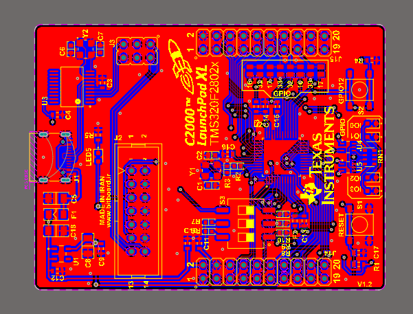
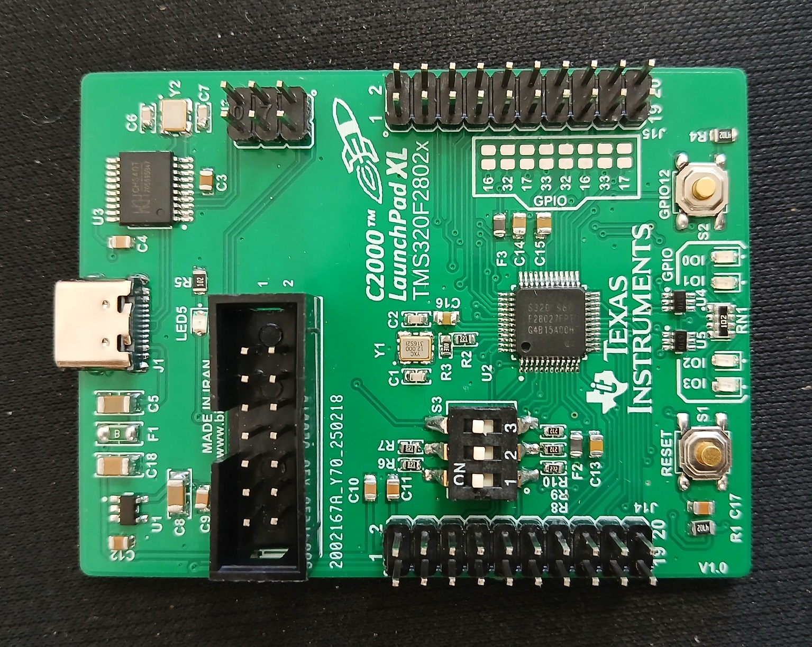

# TMS320F28027 Development Board

A compact and professional development board based on the **TMS320F28027** microcontroller from Texas Instruments’ C2000 family. This board is designed for **real-time control applications** such as **motor control**, **switch-mode power supplies**, **inverters**, and other **industrial automation systems**.

---

  

  

---

## ⚙️ Key Features

- **Microcontroller**: TMS320F28027 (32-bit, C2000 Delfino Series)
- **Core**: High-performance control DSP (C28x core)
- **Clock Speed**: Up to 60 MHz
- **Programming Interface**: Standard 14-pin JTAG connector
- **USB Communication**:
  - USB Type-C interface
  - USB-to-UART bridge for serial communication and debugging

- **On-board Peripherals**:
  - Digital I/O headers
  - High-resolution ADC
  - PWM modules for motor control
  - On-board voltage regulators
  - Timers and interrupt support

---

## 💡 Applications

This board is ideal for:

- Sensorless or sensored motor control (BLDC, PMSM, ACIM)
- Switch-mode power supply (SMPS) development
- DC-DC converters, inverters
- Real-time industrial control systems
- DSP algorithm prototyping and educational purposes

---
